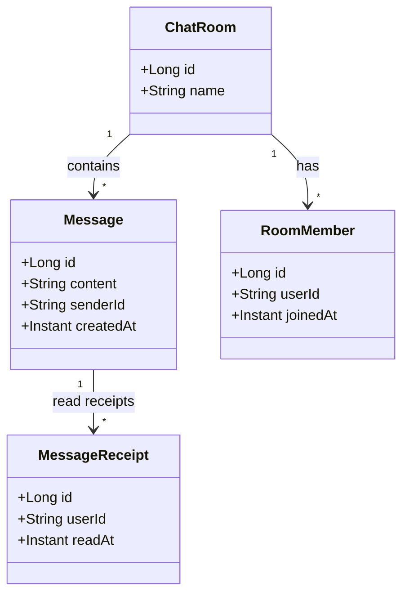
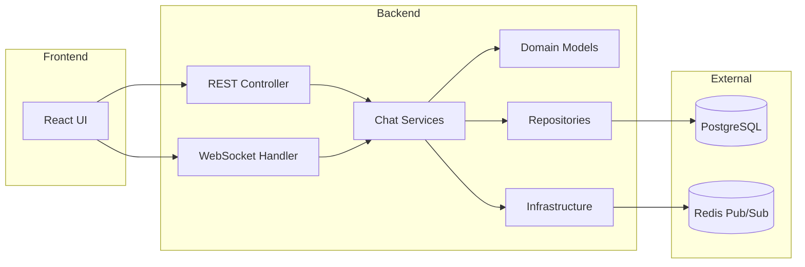
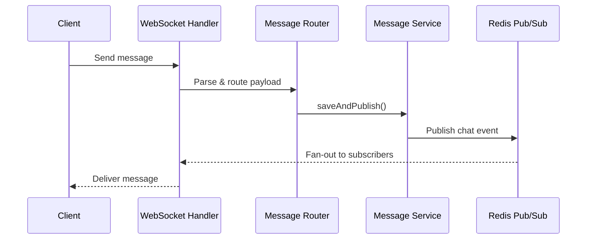
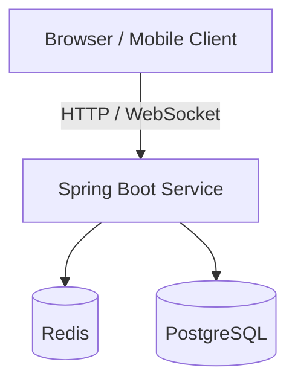
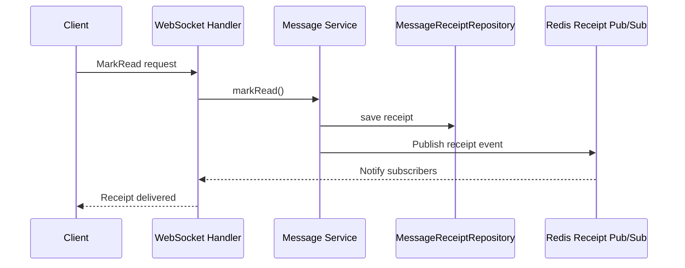

# 4+1 Architecture Views

This document captures the 4+1 architectural views for the Spring Chat application. Each view is aligned to key packages and runtime behavior in the codebase.

## 1. Logical view

Represents the core domain model and how entities relate to each other.

## 2. Development view

Shows the main modules and their dependencies within the repository.

## 3. Process view

Highlights runtime interactions for common flows, focusing on concurrency and messaging.

## 3.1 WebSocket infra architecture (IO / realtime layer)

### 1) Responsibilities & boundaries

Infra WebSocket is the IO/realtime layer responsible for:

- Receiving raw WebSocket frames, parsing JSON, and converting to the envelope contract.
- Routing by `type` (command) to the corresponding handler.
- Validating payloads at the IO boundary before calling services.
- Broadcasting realtime events to subscribers via the broadcaster + message sender.

**Important boundary**: `WebSocketSession` only exists in the infra layer. Handlers may accept it for IO context, but services are called with domain/DTO data only (no session leakage).

### 2) Inbound pipeline (Client → Server)

**a) WebSocket entrypoint**
- `ChatWebSocketHandler` reads text frames and deserializes them into `ClientMessageEnvelope`.
- When parsing fails, it returns an error envelope with the standard `v/type/id/ts/payload` shape.

**b) Router & mapping**
- `WebSocketMessageRouter` selects a handler by `envelope.type()`. Unknown or empty types are logged and ignored to preserve backward compatibility.
- Payloads are converted into typed DTOs via `ObjectMapper`.

**c) Per-command handlers**
Each handler receives:
- `WebSocketSession` (IO context only).
- A typed DTO payload (validated).

Examples:
- `SendChatMessageHandler` calls `messageService.saveAndPublish(...)`.
- `MarkReadMessageHandler` calls `messageService.markRead(...)`.
- `Subscribe/Unsubscribe` handlers update registry subscriptions used for fan-out.

### 3) Session & subscription registry

**a) SessionRegistry**
- Stores `WebSocketSession` by sessionId, userId, and subscriptions.
- Exposes subscriber lookup by destination for fan-out.

**b) InMemorySessionRegistry**
- Uses `ConcurrentHashMap` to store sessions and destination membership.
- `getSubscribers(destination)` returns only open sessions.

**c) Thread-safety for send**
- Each session has a `sendLock` to serialize writes per session and avoid interleaved frames.

### 4) Outbound pipeline (Server → Client)

**a) Event broadcasting**
- `WebSocketBroadcaster` builds `ServerMessageEnvelope` (`v/type/id/ts/payload`) and sends via `WebSocketMessageSender`.
- Explicit message types (`CHAT_MESSAGE`, `READ_RECEIPT`, `NOTIFICATION`, `ERROR`) avoid semantic ambiguity.

**b) Default sender**
- `DefaultWebSocketMessageSender` serializes the envelope and sends it to each subscriber session.
- Uses per-session locking to serialize `sendMessage()` calls.

### 5) Envelope contract (IO protocol level)

**ClientEnvelope (inbound)**  
`ClientMessageEnvelope` standardizes `v/type/id/ts/payload`.

**ServerEnvelope (outbound)**  
`ServerMessageEnvelope` standardizes `v/type/id/ts/payload`.

## 4. Physical view

Deployment topology for local or containerized environments.

## 5. Scenarios (+1)

A representative use case: marking a message as read.

