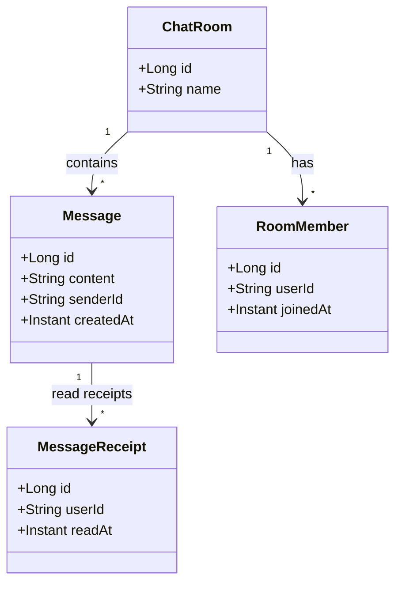
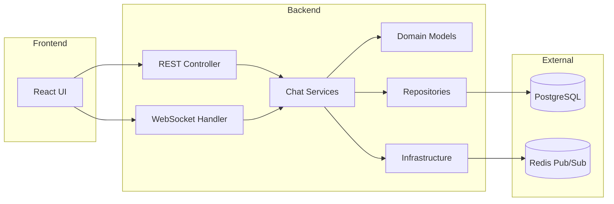
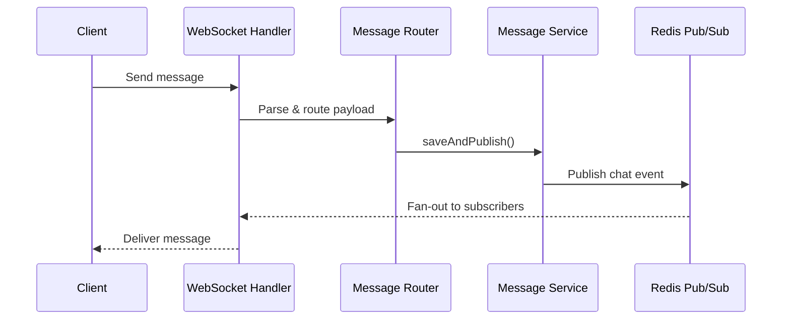
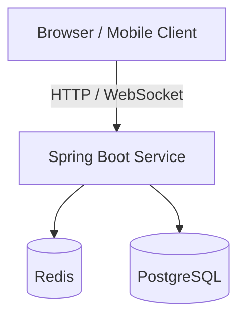
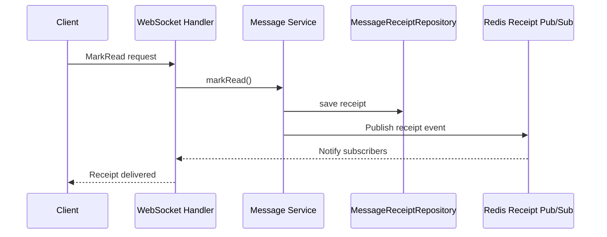

# 4+1 Architecture Views

This document captures the 4+1 architectural views for the Spring Chat application. Each view is aligned to key packages and runtime behavior in the codebase.

## 1. Logical view

Represents the core domain model and how entities relate to each other.

## 2. Development view

Shows the main modules and their dependencies within the repository.

## 3. Process view

Highlights runtime interactions for common flows, focusing on concurrency and messaging.

## 4. Physical view

Deployment topology for local or containerized environments.

## 5. Scenarios (+1)

A representative use case: marking a message as read.

